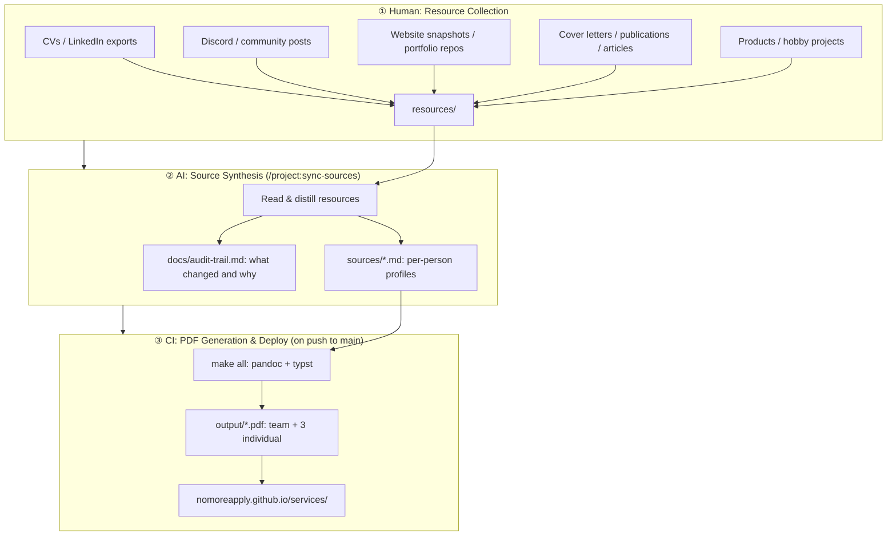

# NoMoreApply: Services Brochure Pipeline

**Stage 1** is manual: gather raw materials into `resources/`.  
**Stage 2** is AI-driven: run `/project:sync-sources` to synthesize `sources/*.md` from the latest resources.  
**Stage 3** is automated: push to `main` triggers GitHub Actions, builds PDFs, deploys to Pages.

---

## Members

- Angel Aytov: AI systems, GraphRAG, cloud infrastructure (AWS)
- Catalin Waack: Full-stack product engineering, Shopify, rapid MVP delivery
- Cosmin Poieana: Fractional AI strategy, Python, agentic systems

## Live PDFs

[nomoreapply.github.io/services/](https://nomoreapply.github.io/services/)
