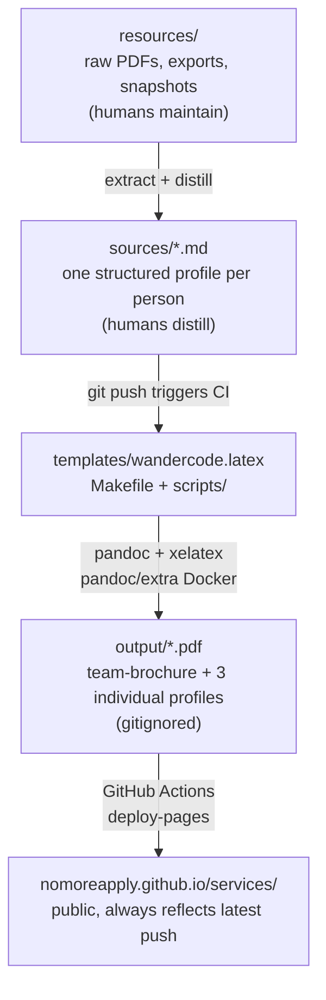

# NoMoreApply — Services Brochure Pipeline

```mermaid
flowchart TD
    A["resources/\nraw PDFs, exports, snapshots\n(humans maintain)"]
    B["sources/*.md\none structured profile per person\n(humans distill)"]
    C["templates/wandercode.latex\nMakefile + scripts/"]
    D["output/*.pdf\nteam-brochure + 3 individual profiles\n(gitignored)"]
    E["nomoreapply.github.io/services/\npublic, always reflects latest push"]

    A -->|"extract + distill"| B
    B -->|"git push triggers CI"| C
    C -->|"pandoc + xelatex\npandoc/extra Docker"| D
    D -->|"GitHub Actions\ndeploy-pages"| E
```
