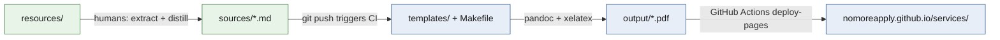

# NoMoreApply — Services Brochure Pipeline

```mermaid
flowchart LR
    classDef manual fill:#e8f4e8,stroke:#4a7c4a,color:#1a1a1a
    classDef auto   fill:#e8eef8,stroke:#3a5f8a,color:#1a1a1a

    A[resources/]:::manual
    B[sources/*.md]:::manual
    C[templates/ + Makefile]:::auto
    D[output/*.pdf]:::auto
    E[nomoreapply.github.io/services/]:::auto

    A -->|humans: extract + distill| B
    B -->|git push triggers CI| C
    C -->|pandoc + xelatex| D
    D -->|GitHub Actions deploy-pages| E
```

**Green = human-maintained. Blue = fully automated by CI.**
